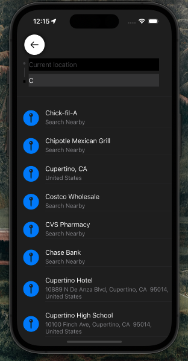
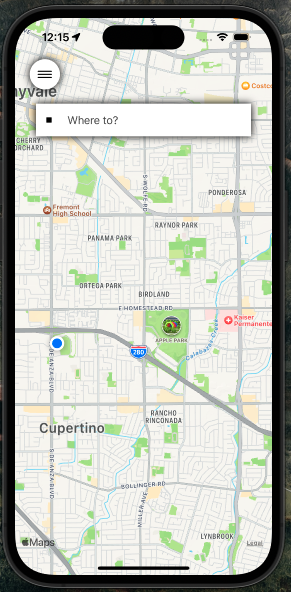
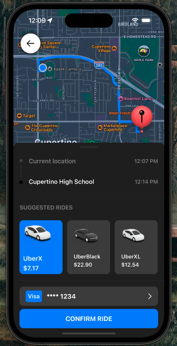
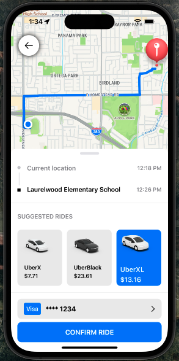

# UberClone
Uber Clone built with SwiftUI, iOS 16 & Xcode 14. This was built with a MVVM architecture. 

### Current capabilities include: 

  * Ability to dynamicaly calculate cost of trip
  * Resets the mapview when searching diffrent desinations
  * Light and Dark mode support
  * And more!

### Preview

### Technologies used

  * Swift UI
  * MapKit
  * CoreLocation
  * Darkmode support

